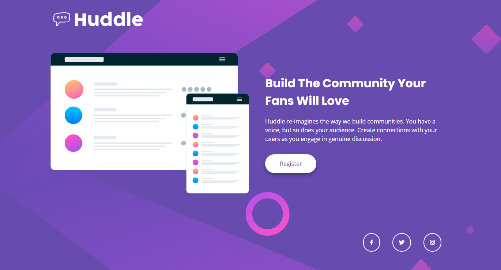

# Frontend Mentor - Huddle landing page with single introductory section solution

This is a solution to the [Huddle landing page with single introductory section challenge on Frontend Mentor](https://www.frontendmentor.io/challenges/huddle-landing-page-with-a-single-introductory-section-B_2Wvxgi0). Frontend Mentor challenges help you improve your coding skills by building realistic projects. 

## Table of contents

- [Overview](#overview)
  - [The challenge](#the-challenge)
  - [Screenshot](#screenshot)
  - [Links](#links)
- [My process](#my-process)
  - [Built with](#built-with)
  - [What I learned](#what-i-learned)
- [Author](#author)

## Overview

### The challenge

Users should be able to:

- View the optimal layout for the page depending on their device's screen size
- See hover states for all interactive elements on the page

### Screenshot

### Links

- Solution URL: [GitHub Repo](https://github.io/GentryHQ)
- Live Site URL: [GitHub Page](https://github.io/GentryHQ)

## My process

### Built with

- Semantic HTML5 markup
- CSS custom properties
- Flexbox
- Media Query
- Mobile-first workflow

### What I learned

- It's my first using font awesome icons in my project, I've always used svgs. While integrating Font awesome into my project, I ran into some issues, the icons were not showing. So it taught me the right ways of linking and not so great way of linking resources. 

## Author

- Website - [Gentry.com.ng](https://www.gentry.com.ng)
- Frontend Mentor - [GentryHQ](https://www.frontendmentor.io/profile/GentryHQ)
- Twitter - [@iam_gentry](https://www.twitter.com/iam_gentry)

